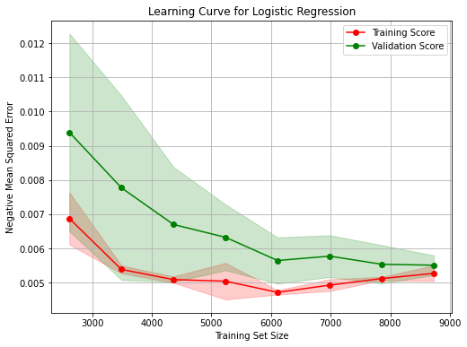
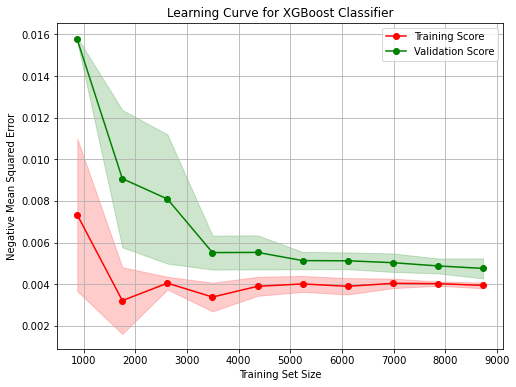
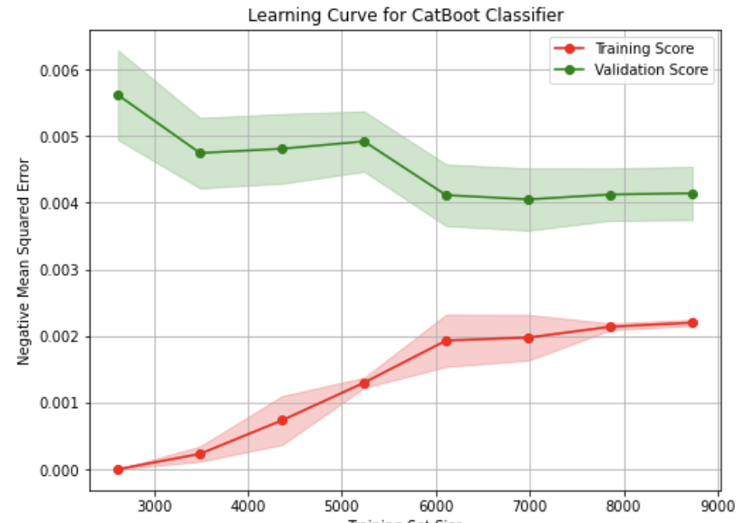

# Predicting Machine Failures

This project applies supervised machine learning techniques to predict machine failures in an industrial setting using sensor data. The goal is to improve maintenance strategies by proactively identifying potential issues before they occur, thereby reducing downtime and maintenance costs.

## 📊 Problem Statement

Unplanned machine failures can lead to significant operational disruptions, safety hazards, and financial loss. By leveraging machine learning, we aim to build a binary classifier that can distinguish between failure and non-failure scenarios based on historical sensor data.

## 🧠 Models Used

Three supervised learning models were trained and evaluated:

- **Logistic Regression** *(Benchmark Model)*
- **XGBoost Classifier**
- **CatBoost Classifier**

## 🗃️ Dataset

- Source: Kaggle (Binary Classification of Machine Failures)
- Two files: `train.csv` (includes target variable), `test.csv` (target excluded)
- Target variable: `Machine failure` (binary: 0 = no failure, 1 = failure)
- Total features: 13 excluding `id`

## 🧪 Evaluation Metrics

- **Accuracy**
- **Precision**
- **Recall**
- **F1-Score**

## 📈 Results Summary

| Model                | Accuracy | Recall   | Precision | F1-score |
|---------------------|----------|----------|-----------|----------|
| Logistic Regression | 0.9962   | 0.7671   | 0.9912    | 0.8649   |
| XGBoost Classifier  | 0.9961   | 0.7671   | 0.9853    | 0.8626   |
| CatBoost Classifier | 0.9962   | 0.7671   | 0.9912    | 0.8649   |

With oversampling applied:

| Model                | Accuracy | Recall   | Precision | F1-score |
|---------------------|----------|----------|-----------|----------|
| Logistic Regression | 0.9804   | 0.8037   | 0.4389    | 0.5677   |
| XGBoost Classifier  | 0.9801   | 0.8219   | 0.4364    | 0.5701   |
| CatBoost Classifier | 0.9736   | 0.8516   | 0.3625    | 0.5085   |

## 📉 Learning Curves

  
  
  

## 🧰 Project Workflow

- Data Loading
- Exploratory Data Analysis
- Preprocessing & Cleaning
- Train-Test Split
- Model Training
- Evaluation & Visualization
- Comparison & Interpretation
